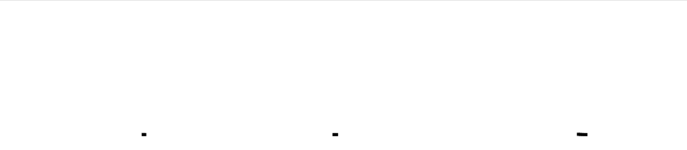
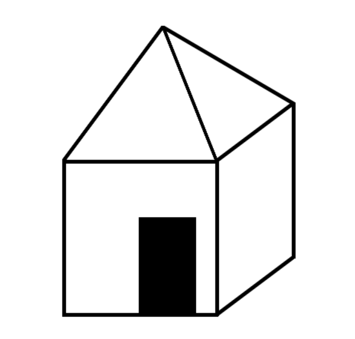

# ComputerGraphics_HW1
Homework 1 on computer graphics [5 semester]
 Tasks:
 - [X] realise trajectory movement
 - [X] draw something

# Task_1 - Realise trajectory movement
 > 1.1 - Sinusoidal motion:
 
 > 1.2 - Lissajous figures
 
 > 1.3 - Сircular motion 

# Task_2 - Draw something
 > Home 
